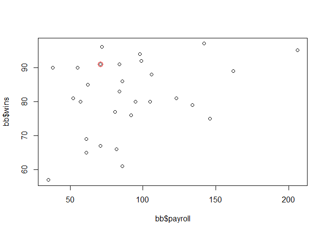
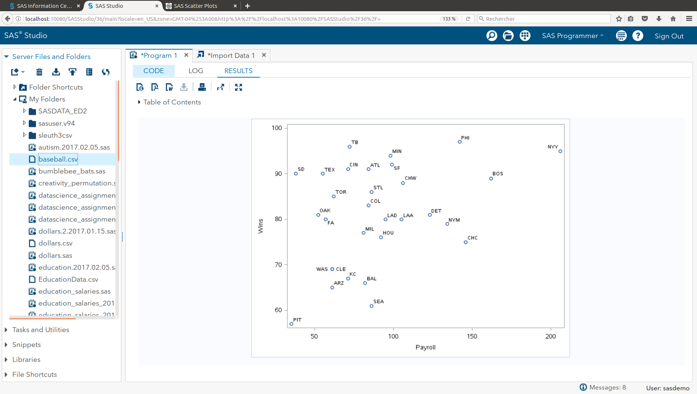
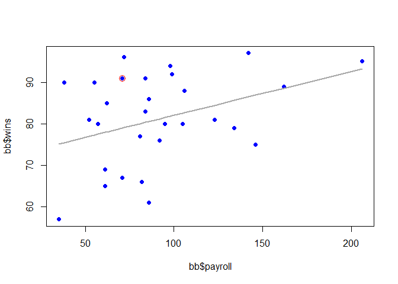
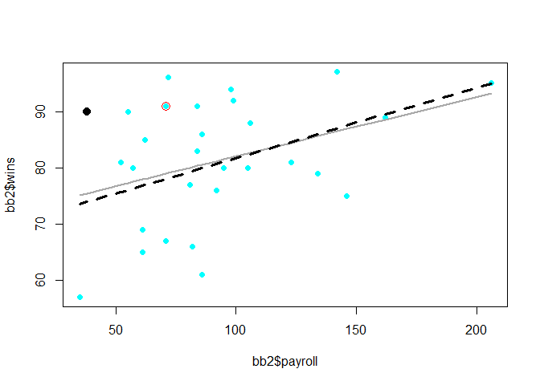

Baseball
--------

    ##       Team       Payroll            Wins      
    ##  ARZ    : 1   Min.   : 35.00   Min.   :57.00  
    ##  ATL    : 1   1st Qu.: 61.25   1st Qu.:75.25  
    ##  BAL    : 1   Median : 84.00   Median :81.00  
    ##  BOS    : 1   Mean   : 90.23   Mean   :81.00  
    ##  CHC    : 1   3rd Qu.:103.50   3rd Qu.:90.00  
    ##  CHW    : 1   Max.   :206.00   Max.   :97.00  
    ##  (Other):24

    ## 'data.frame':    30 obs. of  3 variables:
    ##  $ Team   : Factor w/ 30 levels "ARZ","ATL","BAL",..: 19 4 5 21 18 10 6 14 25 17 ...
    ##  $ Payroll: int  206 162 146 142 134 123 106 105 99 98 ...
    ##  $ Wins   : int  95 89 75 97 79 81 88 80 92 94 ...

### 1. Provide a scatterplot of the data using both SAS and R.

    plot(bb$wins ~ bb$payroll)

    points(df_CIN$wins ~ df_CIN$payroll, col = 'red', cex = 1.5)

And the SAS plot ...

Q1.1 : Looking at the scatterplot, do you expect the correlation to be
positive, negative, or close to 0?  
**A1.1 : Based on the initial scatter plot, the correlation is
positive.**

Q1.2 : Why?  
**A1.2 : The trend is showing that with higher payroll, there is a
higher number of wins (generally). The highest number of wins is
associated to the highest payroll, and the lowest number of wins is from
the team with the lowest payroll.**

Q1.3 : Is the relationship between team payroll and number of wins
strong, moderate or weak?  
**A1.3 : The relationship appears generally weak. A tendency, but with a
fair amount of variation from a central tendency.**

Q1.4 : Is the relationship linear?  
**A1.4 : The relationship is generally linear. There is somewhat of
steeper slope at the lower end of the data set and shalllower at the
higher values.**

Q1.5 : Take a guess of the value of the correlation coefficient.  
**A1.5 : From experience, the r^2 value for this data is likely in the
20% range.**

### 2. Find the correlation between team payroll and the number of wins = no fair going back and changing your answer to the previous question! You should do this in both R and SAS.

    r <- cor(bb$payroll, bb$wins)
    r2 <- r * r
    fit_all <- lm(wins ~ payroll, data = bb)

    print(sprintf("Correlation = %9.3f, r^2 = %9.3f", r, r2))

    ## [1] "Correlation =     0.366, r^2 =     0.134"

    plot(bb$wins ~ bb$payroll, col = 'blue', pch = 19)
    lines(fit_all$fitted.values ~ bb$payroll, col = 'darkgrey', lwd = 2)
    points(df_CIN$wins ~ df_CIN$payroll, col = 'red', cex = 1.5)

And the SAS correlation ...

3. San Diego (SD) has a payroll of 38 million, yet has 90 wins – more than Boston does.
---------------------------------------------------------------------------------------

Delete SD from the data and rerun the analysis.  
How does the correlation change? You may use your preference here, R or
SAS.

    bb2 <- bb
    df_SD <- bb2[(bb2$team == "SD"),]
    bb2 <- bb2[!(bb2$team == "SD"),]
    bb2

    ##    team payroll wins
    ## 1   NYY     206   95
    ## 2   BOS     162   89
    ## 3   CHC     146   75
    ## 4   PHI     142   97
    ## 5   NYM     134   79
    ## 6   DET     123   81
    ## 7   CHW     106   88
    ## 8   LAA     105   80
    ## 9    SF      99   92
    ## 10  MIN      98   94
    ## 11  LAD      95   80
    ## 12  HOU      92   76
    ## 13  SEA      86   61
    ## 14  STL      86   86
    ## 15  ATL      84   91
    ## 16  COL      84   83
    ## 17  BAL      82   66
    ## 18  MIL      81   77
    ## 19   TB      72   96
    ## 20  CIN      71   91
    ## 21   KC      71   67
    ## 22  TOR      62   85
    ## 23  ARZ      61   65
    ## 24  CLE      61   69
    ## 25  WAS      61   69
    ## 26   FA      57   80
    ## 27  TEX      55   90
    ## 28  OAK      52   81
    ## 30  PIT      35   57

    r_sansSD <- cor(bb2$payroll, bb2$wins)
    r2_sansSD <- r_sansSD * r_sansSD
    fit_sansSD <- lm(wins ~ payroll, data = bb2)

    print(sprintf("Without San Diego : correlation = %9.3f, r^2 = %9.3f", r_sansSD, r2_sansSD))

    ## [1] "Without San Diego : correlation =     0.426, r^2 =     0.181"

    plot(bb2$wins ~ bb2$payroll, col = 'cyan', pch = 19)
    lines(fit_all$fitted.values ~ bb$payroll, col = 'darkgrey', lwd = 2)
    lines(fit_sansSD$fitted.values ~ bb2$payroll, col = 'black', lwd = 3, lty = 2)
    points(df_CIN$wins ~ df_CIN$payroll, col = 'red', cex = 1.5)
    points(df_SD$wins ~ df_SD$payroll, col = 'black', pch = 20, cex = 2)

### 4. The league commissioner notes that the Texas Rangers with one of the lowest payrolls won 90 games (and were the American League Champions) and the Chicago Cubs with the highest payroll won only 75 games. This, he argues, proves there is no advantage to teams with a higher payroll. Comment on his argument.

### 5. What is the population for these data? Can these data be considered as a random sample from that population?
